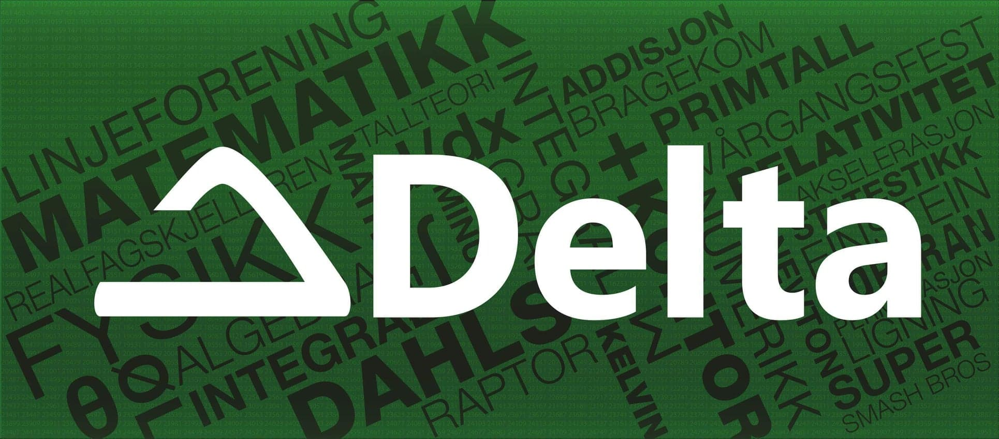

# Deltahouse
This is the source code for the future [deltahouse.no](https://www.deltahouse.no).

## Setup
1. Clone repo
2. Run `yarn install` from root directory
3. Run `yarn setup` from root directory

## Structure
Static SPA (CSR with prerendered html).
PostCSS used for styling, see webpack config for plugins used.
Microarchitecture /w Docker

## Microservices
 - NGINX: Reverse proxy, serves content (prerendered site, bundle and media)
 - Events: Responsible for handling events; CRUD, tickets, etc. 
